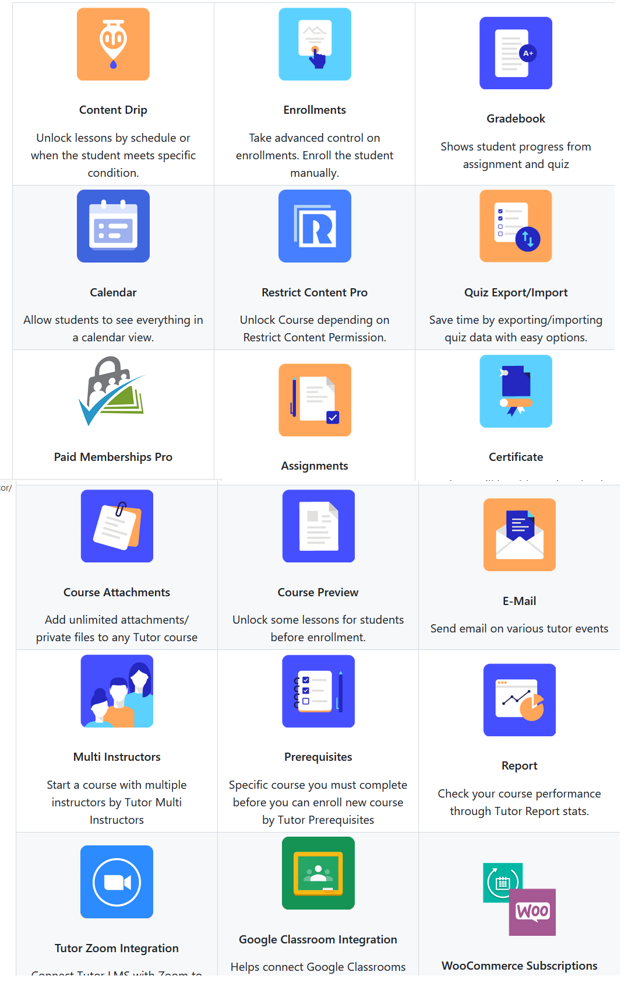

# LMS

TutorLMS
What is Tutor LMS?

Tutor LMS is a complete, feature-packed, and robust WordPress LMS plugin to easily create & sell courses online. All the features of this learning management system hit all the checkpoints for a full-fledged online course marketplace.
WPCS configuration

Step 1: Please install these two composer package.

1. composer global require squizlabs/php_codesniffer
2. composer global require wp-coding-standards/wpcs

Step 2: Set WordPress as default coding standard. (change your_username)

phpcs --config-set installed_paths /Users/your_username/.composer/vendor/wp-coding-standards/wpcs
phpcs --config-set default_standard WordPress

Problem Fix:

If phpcs and phpcbf command not found as command, set it to your path variable.

export PATH="/Users/your_username/.composer/vendor/bin:$PATH"
Development Setup

Follow the steps

    Configure WPCS to write code that complies with the WordPress Coding Standard.
    Clone the repository git clone https://github.com/themeum/tutor.git.
    Checkout to dev brunch git checkout dev
    Make your own brunch git checkout -b your_brunch_name
    Go to vscode extension tab and install recommended extension.
    Run composer install for install PHP dependency.
    Run npm install for install js dependency.
    Run npm run watch
    Now open any SCSS file from assets directory and hit save.

Contribution Guide

    Make sure your code complies with the WordPress Coding Standard (WPCS) before open a PR.
    Open a pull request (PR) to the dev branch. PRs to other branches will be closed without any discussion.

Unit Testing

To run PHP unit testing in the development environment follow the below steps:

Go to the terminal then hit commands:

    composer install
    bash bin/install-wp-tests.sh db_name user_name password host latest ( checkout details )
    vendor/bin/phpunit --info

If everything goes well then you should see the PHP unit info
System Requirements

    PHP – 7.0 (or later)

    Database – MariaDB – 10.1 or later / MySQL – 5.7 or later

    WordPress 5.5 or higher

    Browser – Chrome, Firefox, Safari

    Internet Explorer is not supported

    Server Modules – mod_rewrite, cURL, fsockopen

    Download the free Tutor LMS 2.0 Beta file To get the free version of the Tutor LMS 2.0 :

    Navigate to the Tutor LMS GitHub.

    Download the Tutor 2.0 install zip file

    Create a backup version of your entire site before you plan to install it. Ideal usage, we reiterate, would be to install it on a test site to see and try out the new features without breaking anything.

    Download the Pro Tutor LMS 2.0 Beta file

    Follow along to download the pro version of Tutor LMS 2.0.

Note: The pro version is only available to the pro users of Tutor LMS and can only be availed by them. Check the previous section to download the free release if you do not own Tutor Pro.

Log in to your Themeum account and navigate to the downloads page. Click on download under the release file and the zip file should start downloading for you. Installing the Tutor LMS Beta Plugins (Both Free & Pro) The installation process for both the free and pro versions is the same since we are installing a zip file. Once again we urge you to create a back of your site or use a test environment before going ahead with the installation.
Content Drip
Content Drip
Unlock lessons by schedule or when the student meets specific condition. 	Enrollments
Enrollments
Take advanced control on enrollments. Enroll the student manually. 	Gradebook
Gradebook
Shows student progress from assignment and quiz
Calendar
Calendar
Allow students to see everything in a calendar view. 	Enrollments
Restrict Content Pro
Unlock Course depending on Restrict Content Permission. 	Quiz Export/Import
Quiz Export/Import
Save time by exporting/importing quiz data with easy options.
Paid Memberships Pro
Paid Memberships Pro
Maximize revenue by selling membership access to all of your courses. 	Assignments
Assignments
Tutor assignments is a great way to assign tasks to students. 	Certificate
Certificate
Students will be able to download a certificate after course completion.
Course Attachments
Course Attachments
Add unlimited attachments/ private files to any Tutor course 	Course Preview
Course Preview
Unlock some lessons for students before enrollment. 	E-Mail
E-Mail
Send email on various tutor events
Multi Instructors
Multi Instructors
Start a course with multiple instructors by Tutor Multi Instructors 	Prerequisites
Prerequisites
Specific course you must complete before you can enroll new course by Tutor Prerequisites 	Report
Report
Check your course performance through Tutor Report stats.
Tutor Zoom Integration
Tutor Zoom Integration
Connect Tutor LMS with Zoom to host live online classes. Students can attend live classes right from the lesson page. 	Google Classroom Integration
Google Classroom Integration
Helps connect Google Classrooms with Tutor LMS courses, allowing you to use features like Classroom streams and files directly from the Tutor LMS course. 	WooCommerce Subscriptions
WooCommerce Subscriptions
Capture Residual Revenue with Recurring Payments.
WPML Multilingual CMS
WPML Multilingual CMS
Create multilingual courses, lessons, dashboard and more for a global audience. 	Notifications
Notifications
Get notifications on frontend dashboard for specified tutor events. 	BuddyPress
BuddyPress
Discuss about course and share your knowledge with your friends through BuddyPress
FAQ

Is it safe to use Tutor LMS 2.0 Beta on your production site?

Tutor LMS 2.0 Beta is an experimental build meant for testing purposes. We strongly recommend you not to use Tutor LMS 2.0 Beta on your production sites. Use it on staging environments and remember to backup your entire website before updating.

Will I get any support for Tutor LMS 2.0 Beta?

Since this is an experimental release and should not be used on production sites, we won’t be providing any support for Tutor LMS 2.0 Beta.

Where can I report bugs or provide feedback?

In the description section, you’ll see a form with the text Report an Issue. In this form, you can fill in your issues or provide your feedback regarding the Beta release
